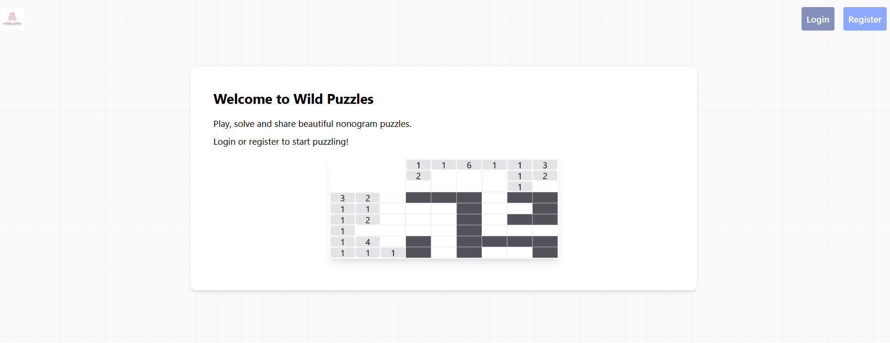

# CITS3403_GroupProject
Our group project for CITS3403. Group Members: Jeffrey Peng, Elizabeth Shibu, Ryan Koo, Ethan van Bruchem.

# Our Project - Wild Puzzles
Wild Puzzles is a nonogram puzzle creation and sharing site.
Users are able to add friends (one-way) and will be able to view statistics such as a score that is given based on the amount of and difficulty of puzzles solved.
A puzzle select page is available which displays the user's created puzzles, those created by their friends, as well as various other puzzles in the database sorted by how many people have solved them.


| Name              | Student Number | Github Username |
|-------------------|----------------|-----------------|
| Ethan van Bruchem | 23722756       | EthanVB123      |
| Jeffrey Peng      | 24852661       | jpengg          |
| Ryan Koo          | 23916437       | ryankjy         |
| Elizabeth Shibu   | 24221904       | LizzieDevelops  |

# Instructions
To launch the site, open up the command prompt and run:

```bash
set FLASK_APP=run.py
set FLASK_ENV=development
flask db upgrade

py run.py
```
Then go to this address in your browser: http://localhost:5000/

From here you can register an account, and login.


From your profile, you have access to the puzzle create, friends, and puzzle select pages.
In the puzzle create page, you can name a puzzle and customize the size of a puzzle, then select boxes to create the nonogram puzzle.
The numbers on the side giving hints to the player will update automatically when boxes are selected.
After puzzle creation, you can complete the puzzle to test it out, and will be redirected to your profile after.
In the friends page, you can add friends 