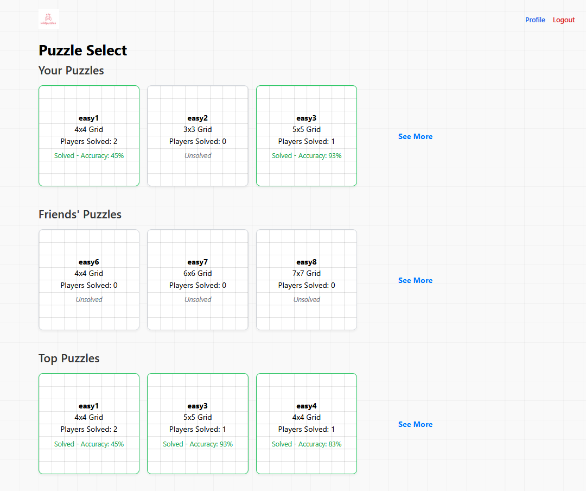

# CITS3403_GroupProject
Our group project for CITS3403. Group Members: Jeffrey Peng, Elizabeth Shibu, Ryan Koo, Ethan van Bruchem.

# Our Project - Wild Puzzles
Wild Puzzles is a nonogram puzzle creation and sharing site.
Users are able to add friends (one-way) and will be able to view statistics such as a score that is given based on the amount of and difficulty of puzzles solved.
A puzzle select page is available which displays the user's created puzzles, those created by their friends, as well as various other puzzles in the database sorted by how many people have solved them.


| Name              | Student Number | Github Username |
|-------------------|----------------|-----------------|
| Ethan van Bruchem | 23722756       | EthanVB123      |
| Jeffrey Peng      | 24852661       | jpengg          |
| Ryan Koo          | 23916437       | ryankjy         |
| Elizabeth Shibu   | 24221904       | LizzieDevelops  |

# Instructions to Load Server and Run Tests
First, ensure you are in a virtual environment, then import requirements.txt:
```
pip install -r requirements.txt
```
Then, to launch the site, open up the command prompt, import modules present in requirements.txt, make sure you have a database file (referred to in this document as `DBFILENAME.db`) located in the `app` directory and run: (Note these commands work in Windows Command Prompt. If using PowerShell/other terminal, there may be different commands to set environment variables.)
```
set FLASK_APP=run.py
set FLASK_ENV=development
set FLASK_SECRET_KEY=extremelysecret
set FLASK_DATABASE_FILENAME=DBFILENAME.db (or whatever it is called)
```
Then, if you are creating a new database with a blank db file, run:
```
flask db upgrade
```
Finally, to run the server, use:
```
py run.py
```
Alternatively, to run the unit tests, use:
```
python -m unittest app/tests/unittests.py
python -m unittest app/tests/systemtests.py
```

# Sample Database Details
The sample database `sample.db` (not in the GitHub repository, only in the submission ZIP) is pre-filled with 6 users, 6 puzzles, and several relationships.
To sign in as any of these users, here are their login details:

| Username         | Password       |
|------------------|----------------|
| User1           | Password1      |
| User2           | Password2      |
| John            | Ilovemydog     |
| XxPuzzle_SlayerxX | 13371337      |
| Roberta         | RJenkins13     |
| TheLogician     | puzzlemaster1  |

# Instructions on Usage of Server
To access the homepage, go to this address in your browser: http://127.0.0.1:5000/

You should now be on the home page, and from here you can register an account, and login.


After registering, you can access your profile.
Your profile has links to the puzzle create, friends, and puzzle select pages.
In the puzzle creation page, you can name a puzzle and customize its size


Pressing create puzzle will send you to the next step, where you can click on boxes to create the nonogram puzzle.


The numbers on the side giving hints to the player will update automatically when boxes are selected.
After puzzle creation, you can complete the puzzle to test it out, and will be redirected to your profile after submitting.

In the friends page, you can add friends (the friendship is one-way) and view the friends you currently have.
Typing inside the friend add box will bring up a dropdown box of all the usernames matching what you have typed.
You can remove friends using the remove friend button.


In the puzzle select page, you can view puzzles created by you and your friends, as well as other puzzles sorted by solves.



# AI Contributions
In general, AI was used in this project - the bulk of the logic was written manually, and AI was often used to quickly write boilerplate code, and help correct errors.
For specific elements:
## Static Files
- Homepage image screenshot from our website manually.
- Logo.app tool (non-AI) used to make logo.
- `createPuzzle.js`: No AI used.
- `friends_page.js`: Dynamic AJAX code for searching for new friends created with significant assistance from AI, rest of page created with minor assistance from AI.
- `puzzle_select.js`: No AI used.
- `script.js`: AI boilerplate template was filled in for our application manually.
- `solvePuzzle.js`: No AI used, except to write the matrix transpose function (~1% of code in file).
- All CSS: Manually written, with AI used as a consultant to provide feedback, which was manually implemented.
## Jinja Templates
- Background of Jinja templates as styled in `<body>` element was AI-assisted.
- Pages were manually written, with use of AI to help correct mistakes.
## Unit and System Tests
- All testing code was written entirely by hand. No AI used.
## Python Code Files
- Initially, `__init__.py` and `config.py` were created by hand. AI was used to help convert them to an app factory model.
- `forms.py` was written with minor AI assistance.
- `models.py` was written entirely without AI.
- `routes.py` was written without AI, but AI was used to help fix errors.
- `verifySolution.py` was written without AI.
- `run.py` was written without AI, but AI was used to help fix errors.
## Other Files
- Migration scripts were autogenerated, then manually edited.
- Group meeting files were written by hand/typed by hand.
- `requirements.txt` was autogenerated.
- `.gitignore` was written by hand.
- `README.md` was written by hand.

